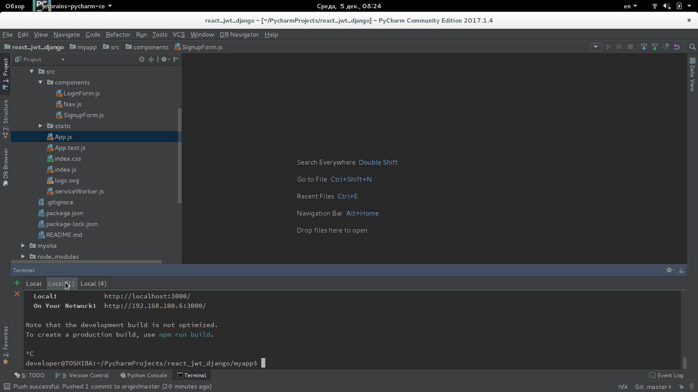

# otus_webpython_023

Login And Registration on Django&React separately.


## Проверка работоспособности


Run at first terminal window:
```
python3 manage.py migrate
```

Run at second terminal window:

```
cd myapp/ && npm start
```

Worked urls:
* Django (mysite)
  * http://127.0.0.1:8000/
  * http://127.0.0.1:8000/core_app/users/
  * http://127.0.0.1:8000/core_app/current_user/
* React (myapp)
  * http://127.0.0.1:3000/


Look GIF-animation:
<kbd></kbd>

## Авторы

* https://medium.com/@dakota.lillie/django-react-jwt-authentication-5015ee00ef9a
* **BorisPlus** - [https://github.com/BorisPlus/otus_webpython_023](https://github.com/BorisPlus/otus_webpython_025)

## Лицензия

Свободно

## Дополнительные сведения

Проект в рамках домашнего задания курса "Web-разработчик на Python" на https://otus.ru/learning
