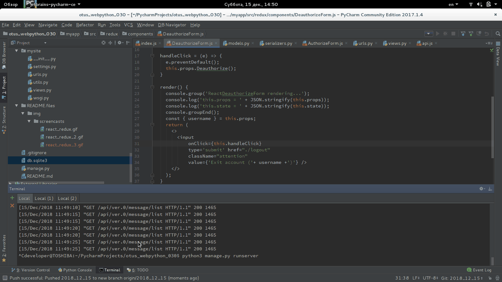
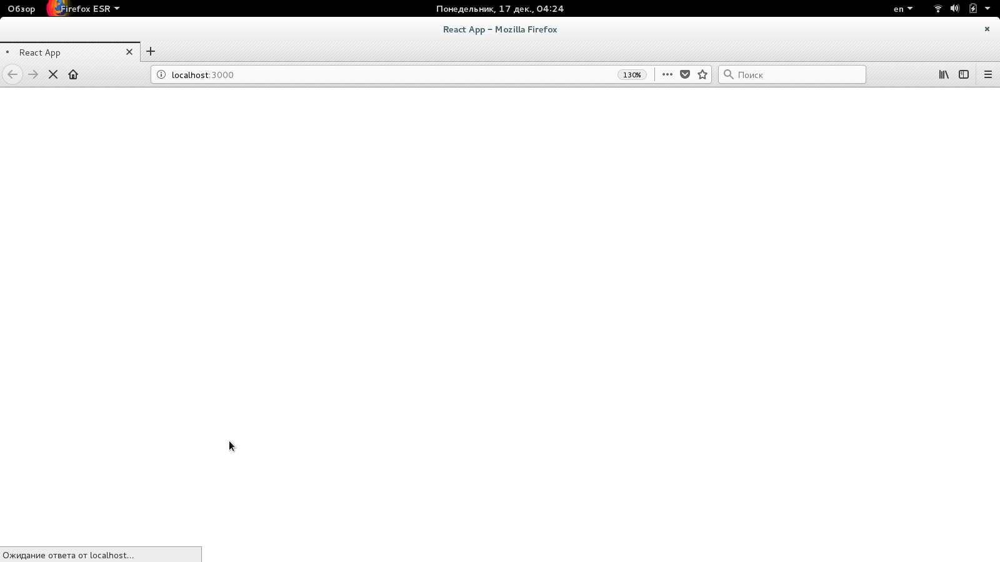

# otus_webpython_030

Login And Registration on "Django" + "Redux&React" separately.

This is not the clean mono-repository!

It contains real two parts - **backend** and **frontend**. They are independent and communicated by API.

Look at its GIF-animation:
<kbd></kbd>

After refactor and user-friendly:
<kbd></kbd>

## Checking

Run **backend** at first terminal window:
```bash
python3 manage.py runserver
```
```text
fuser -k 8000/tcp
```
Run **frontend** at second terminal window:

```bash
cd myapp/ && npm i && npm start
```

```bash
cd myapp/ && npm start
```

Worked urls:
* Django (mysite) - **backend** part
  * http://127.0.0.1:8000/
  * http://127.0.0.1:8000/token-auth/
  * http://127.0.0.1:8000/api/ver.0/
* React (myapp) - **frontend** part
  * http://127.0.0.1:3000/


## Maybe would be needed - my garbage list

 * cd myapp/
 * npm install --save-dev redux
 * npm install --save-dev react-redux
 * npm install --save react react-dom prop-types redux react-redux
 * npm install --save-dev react redux-thunk
 * npm install --save-dev react redux-logger
 * npm install --save-dev weak-key
 
 * npm install -i webpack webpack-cli
 * npm install --save-dev babel-core babel-loader babel-polyfill babel-preset-es2015 babel-preset-react babel-plugin-transform-decorators-legacy 
 * npm install moment --save
 * npm install babel-loader@next
 * npm install --save-dev @babel/core@7
 * npm install --save-dev @babel/core@7
 * npm install --save-dev @babel/plugin-proposal-decorators
 * npm install --save-dev babel-plugin-transform-decorators-legacy
 * npm install --save-dev babel-plugin-transform-class-properties
 * npm install --save-dev @babel/preset-env
 * npm install --save-dev @babel/preset-react

## Manage

### Init Django by default user data

```bash
python3 manage.py init_acl # Access control list
```
Являет собьой последовательный вызов других manage-процедур

```bash
python3 manage.py init_users  # Массовое создание Django пользователей
python3 manage.py init_users_groups  # Массовое создание групп
python3 manage.py init_groups_permissions  # Массовое назначение прав группам
```

### Init Django by default test data

```bash
python3 manage.py init_test_data # Create chats and access to them
```

## Testing

### Test Backend

All:

```bash
python3 manage.py test
```

Separately:

```bash
python3 manage.py test flood_app.tests.LowLevelTDDTestCase # Low level TDD
python3 manage.py test flood_app.tests.UserTestCase # can be creating / exists
python3 manage.py test flood_app.tests.ChatTestCase # can be creating / exists, string_representation, created_recently
python3 manage.py test flood_app.tests.AccessTestCase # uniquest
```

## Router ( not ready homework part )

* https://habr.com/post/329996/
* cd myapp/
* npm install --save react-router-dom

## Author

* https://medium.com/@dakota.lillie/django-react-jwt-authentication-5015ee00ef9a
* **BorisPlus** - [https://github.com/BorisPlus/otus_webpython_030](https://github.com/BorisPlus/otus_webpython_030)

## License

Free

## Additional info

Homework within "Web-разработчик на Python" on https://otus.ru/learning

## Question

### Question FRONTEND

1) localStorage - игнорирует тип данных ?!

```bash
const a = 1;
localStorage.setItem('a', a);

console.log(typeof a); --> number 
console.log(typeof localStorage.getItem('a')); --> string 
```

2) (Разобрался) Объект response, переданный в функцию, в логе консоли отображается пустым

Имеется исключение
```bash
function ResponseException(message='ResponseException', response=null) {
  this.name = "ResponseException";
  this.message = message;
  this.response = response.clone();
};
```

вызываю
```bash
...
  return fetch(restFullUrl, params)
    .then(response => {
      if (!response.ok) {
        throw new ResponseException(response.status + ': ' + response.statusText, response);
      }
      return response;
    }) ...
```
проверяю и имею противоречие

```bash
console.log(error.response); # --> Response { type: "cors", url: "http://localhost:8000/api/ver.0/chat/list", redirected: false, status: 403, ok: false, statusText: "Forbidden", headers: Headers, bodyUsed: false }
console.log('JSON.stringify(error) = ' + JSON.stringify(error)); # -->{"name":"ResponseException","message":"403: Forbidden","response":{}});
console.log('error.response.statusText = ' + error.response.statusText); # --> error.response.statusText = Forbidden
```

Как правильно "печаталь" в лог response?

**ВОТ ТАК:**

```bash
console.log('error.message = ', error.message);
console.log('error.response = ', error.response);
```

### Question backend

1) Для ассоциации токена и пользователя, чтоб выдавать в списке только назначеные ему чаты, реализовал middleware _JWTAuthenticationMiddleware_. 

Все отлично работает на GET запросы: 

и проверяется на факт авторизации во view (@permission_classes([IsAuthenticated])) и

```python
...

@authentication_classes([SessionAuthentication, BasicAuthentication, TokenAuthentication])
@permission_classes([IsAuthenticated])
class ChatList(generics.ListAPIView):
    ...

...
```
и ассоциируется с кем надо

```python
    ...
        user = self.request.user
        if user.is_superuser:
            return models.Chat.objects.order_by('name').all()
        return models.Chat.objects.filter(
            Q(owner=user) |
            Q(access__user=user))...
```
Но при POST запросах пользователь всегда Аноним.
Нашел подобное:

* https://stackoverflow.com/questions/24784985/i-have-a-middleware-where-i-a-want-to-log-every-request-response-how-can-i-acce
* https://stackoverflow.com/questions/49311434/django-middleware-advised-not-to-use-request-post-why

Суть решения в том, что помещать запись в request о пользователе не в свойство user, а в любое другое приватное, например, `request._jwt_user`. И при post запросе опираться на него, что именно этот пользователь и отправил данные. Это фишка или баг Django. Связано видимо с каскдом соответствующих middleware, которые бдят за POST (`CsrfViewMiddleware` и т.п.) и режут его. Все б хорошо, но

а) Приходится исключать IsAuthenticated из @permission_classes для POST запросов

```python
...

@authentication_classes([])
@permission_classes([])
class ChatMessageCreate(generics.ListCreateAPIView):
    ...

...
```
б) Приходится иметь вызов "одного" и "того" же в middleware (что для перфекциониста беда посто)

```python
    def __call__(self, request):
        request._jwt_user = SimpleLazyObject(lambda: self.__class__.get_jwt_user(request))
        request.user = SimpleLazyObject(lambda: self.__class__.get_jwt_user(request))
        return self.process_request(request)
```